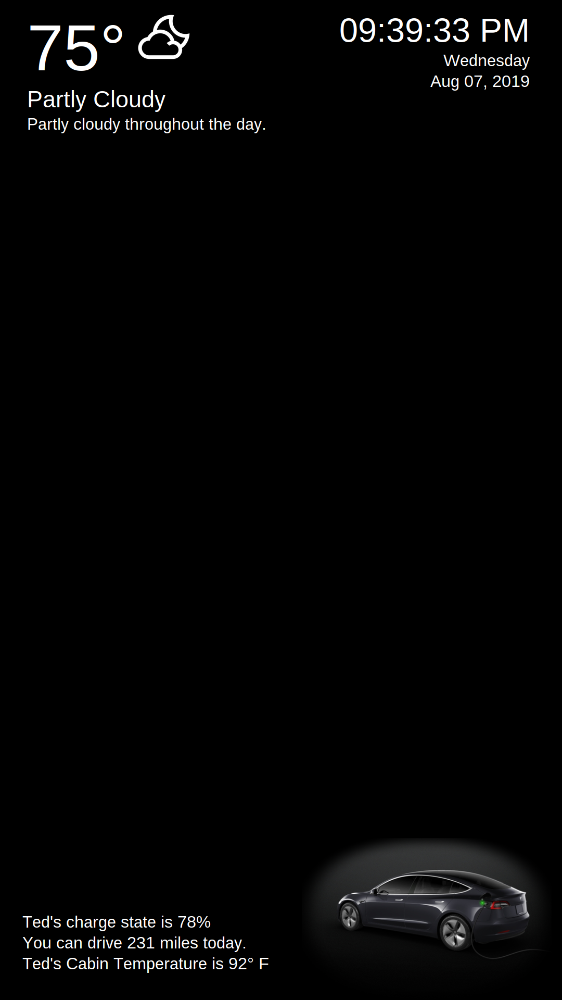
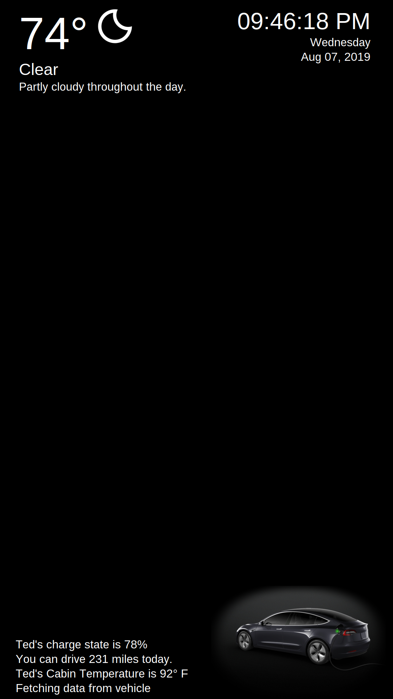

# Teslamirror
Welcome to my Teslamirror project. A raspberry powered, motion sensing smart mirror written in Python that offers the current weather, time, and best of all, integration with your beloved Tesla, as well as physical buttons to perform various smart home functions.
## Project Motivation
For a few months now I've been wanting to make a smart mirror. I like the simplicity of HackerShack's [smartmirror project](https://github.com/HackerShackOfficial/Smart-Mirror) but didn't want to just download the code run with it. Around the same time I was looking for a project to integrate with Tesla's API where they let you do basically anything you can with the app, with a code of your choice. I've been using Python heavily in my education so Greg Glockner's [teslajson library](https://github.com/gglockner/teslajson) was a perfect fit to quickly get started using the API. The combination of the projects became obvious and I'm very pleased with the results.

## External Resources
As stated earlier these projects are a combination of [HackerShack's](https://github.com/HackerShackOfficial/Smart-Mirror) smartmirror project and Greg Glockner's [teslajson library](https://github.com/gglockner/teslajson). I could not have done either of these components as well so I owe them. Follow their instructions to get each respective script running correctly. The files I have uploaded are simply my versions of the files that I had to edit.

## Mirror and Peripherals Details
To build the physical mirror, I sourced a cheap display from a thrift store and tore it down to the metal frame. I built the frame out of 1"x3" finish lumber from the local hardware store and routed out a notch for the display to fit into. Then I used L brackets to connect the pieces at the corner as well as 3D printed brackets to hold the display in the frame. I cut this [1-way Acrylic](https://www.amazon.com/gp/product/B07CWG8DRK/ref=ppx_yo_dt_b_search_asin_title?ie=UTF8&psc=1) from Amazon to the size of the display and sandwiched it between the display and frmae.

Because both existing components were written in Python, I chose a Raspberry Pi Zero W as the basis for this project. It's a bit of a neusance to code on because of the low power but using the Nano text editor in the command line made it bearable. I have definitely embraced the smart home life so I wanted the mirror to also function as a smart home hub of sorts. I added two buttons that I assigned to control my smart blinds as well as refresh the display data and send the pre-condition command to the car. I have removed some details such as API tokens or the interface with my smart home to protect my privacy. These sections are commented for your understanding.

## Code Description
There are two main scripts to run. The smartmirror.py file is an adaptation of the original from HackerShack but with the addition of the vehicle image, which you can replace with your own, and the text to display your vehicles status. This script simply reads a yaml file every 2 seconds and updates the GUI based on the text fields in that file. This yaml file is populated by the other script. Tkinter's mainloop() was a bit combersome to work with so I opted to let another script handle the rest. Remember to fill in your own DarkSky API key.

The second script to run is teslamirror.py which handles motion and button events, fetching the data from the car, and the scheduling of the fetch events. You'll need to authenticate your Tesla account and I found the [eviecar token generator](http://eviecar.io/falcon/teslaweb/?q=generate_token_html) to be a quick way to get a Tesla API Token. The request to the Tesla API can fail if the vehicle does not wake up in time so a try and except seems to work well if the first request doesn't go through. Because waking the vehicle to fetch data can use a noticeable amount of battery if done too often, I chose to wake and update once in the morning at 6 am and then I assigned a button to refresh the data if I want it updated at another time of day.

The button actions are:
1. Button 1
   - if pressed: Trigger blinds
   - if held: Fetch new data from vehicle
2. Button 2
   - if pressed: Open Garagedoor
   - if held: Start cabin conditioning

When any of these actions are triggered, the string entry in the yaml file is updated with a message for a few seconds in teslamirror.py. The smartmirror.py reads this new string in the yaml file and displays a message. After a few seconds, teslamirror.py set's that string equal to '' and the GUI responds by removing the message. This is nice because you get feedback on your inputs as shown below.

## Steps to install
1. Follow the install instructions of the two projects listed above.
   - The respective placement of the folders does not matter as long as the path to the yaml file is correct.
2. Move my smartmirror.py file in the same directory as the original smartmirror.py.
3. Move my teslamirror.py inside the same directory as the original Tesla Jason.
4. Install gpiozero if not already installed following [this guide](https://gpiozero.readthedocs.io/en/stable/installing.html)
5. Install a PyYaml if not already installed using pip found [here](https://pypi.org/project/PyYAML/)
6. Run the two scripts you downloaded from this repository simultaneously.

I hope you enjoy, feel free to make any comments, questions, or suggestions as this is my first public Github project.
